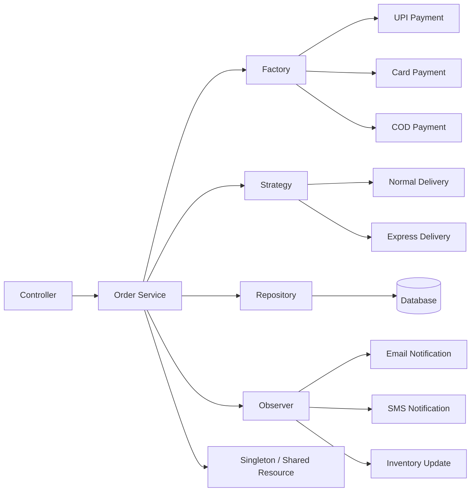
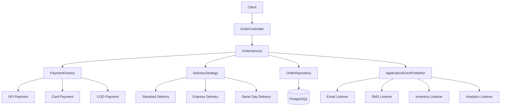
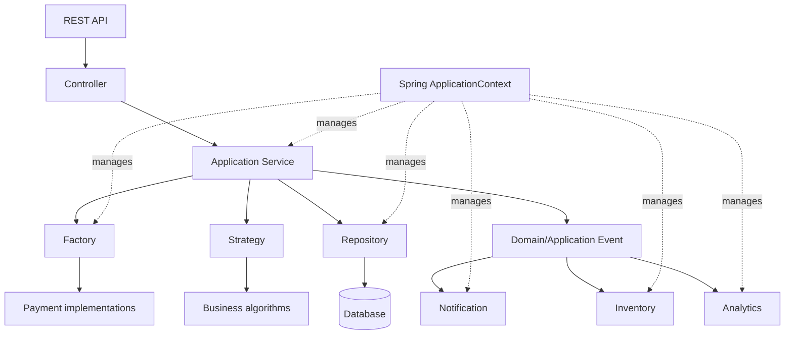

# Software Design Patterns — Beginner → Advanced
> A practical Java + Spring Boot guide to **Singleton, Factory, Strategy, Observer, and Repository**

---

## 0. What Are Design Patterns?

A **design pattern** is a reusable solution structure for a recurring software-design problem.

A pattern is **not** a copy-paste library or framework. It is a way of organizing classes, responsibilities, and relationships.

### Simple analogy

Imagine a restaurant:

- **Factory** → decides which chef/service to create
- **Strategy** → decides how the dish should be prepared
- **Observer** → tells interested people when an order changes
- **Repository** → handles storage/retrieval of ingredients/orders
- **Singleton** → ensures one shared resource/manager exists when one instance is actually required

### Pattern vs algorithm

| Concept | Meaning |
|---|---|
| Algorithm | Steps used to solve a computational problem |
| Design pattern | Structure used to solve a recurring design problem |
| Architecture | High-level organization of an entire system |
| Framework | Software infrastructure that provides reusable functionality |

---

# 1. Why Do We Need Design Patterns?

Without patterns, applications often become:

- tightly coupled
- difficult to test
- difficult to extend
- full of duplicated code
- full of `if/else` or `switch`
- difficult to maintain
- difficult for multiple developers to understand

The goal is **not to use patterns everywhere**.

> Use a pattern when the problem justifies the additional abstraction.

---

# 2. The Five Patterns in One Picture



A typical request can therefore look like:

```text
HTTP Request
     |
     v
Controller
     |
     v
OrderService
     |
     +---- Factory ------> Payment implementation
     |
     +---- Strategy -----> Delivery implementation
     |
     +---- Repository ----> Database
     |
     +---- Observer ------> Notifications / Events
```

---

# 3. SOLID Principles Behind These Patterns

Before learning patterns, understand **SOLID**.

## S — Single Responsibility Principle

A class should have one primary responsibility.

Bad:

```java
class OrderService {
    void createOrder() {}
    void sendEmail() {}
    void saveToDatabase() {}
    void calculateTax() {}
}
```

Better:

```text
OrderService
EmailService
OrderRepository
TaxService
```

---

## O — Open/Closed Principle

Software should be:

- open for extension
- closed for unnecessary modification

Example:

Instead of:

```java
if (payment.equals("UPI")) {
    // ...
} else if (payment.equals("CARD")) {
    // ...
}
```

create:

```java
interface Payment {
    void pay();
}
```

Then:

```java
class UpiPayment implements Payment {}
class CardPayment implements Payment {}
```

Now new payment methods can be added without rewriting the core payment logic.

**Factory + Strategy** frequently help achieve this.

---

## L — Liskov Substitution Principle

A subtype should be usable wherever its abstraction is expected.

```java
Payment payment = new UpiPayment();
payment.pay();
```

`UpiPayment` should behave correctly as a `Payment`.

---

## I — Interface Segregation Principle

Prefer small, focused interfaces.

Instead of:

```java
interface SuperService {
    void pay();
    void deliver();
    void sendEmail();
    void save();
}
```

prefer:

```java
interface Payment {
    void pay();
}

interface Delivery {
    void deliver();
}
```

---

## D — Dependency Inversion Principle

High-level business logic should depend on abstractions rather than concrete implementations.

Bad:

```java
class OrderService {
    private final MySqlOrderRepository repository =
        new MySqlOrderRepository();
}
```

Better:

```java
class OrderService {
    private final OrderRepository repository;

    OrderService(OrderRepository repository) {
        this.repository = repository;
    }
}
```

Spring Boot's dependency injection naturally supports this principle.

---

# 4. Pattern 1 — Singleton

## 4.1 What is Singleton?

Singleton ensures that a class has **one managed instance** and provides a way to access/use that instance.

### Basic idea

```text
Application
     |
     v
+----------------+
| Singleton      |
| Instance       |
+----------------+
   ^    ^    ^
   |    |    |
Service A B Service C
```

---

## 4.2 Real-life example

Imagine an application-wide configuration manager.

You don't normally need every part of the application to create a completely independent configuration manager.

Conceptually:

```text
Application
    |
    +--> Configuration Manager
             |
             +--> Service A
             +--> Service B
             +--> Service C
```

Other examples:

- application configuration
- metrics registry
- shared cache manager
- expensive resource manager

**Important:** Singleton is not automatically appropriate for every shared object.

---

# 4.3 Basic Java Singleton

```java
public class AppConfig {

    private static AppConfig instance;

    private AppConfig() {
    }

    public static AppConfig getInstance() {
        if (instance == null) {
            instance = new AppConfig();
        }

        return instance;
    }
}
```

Usage:

```java
AppConfig a = AppConfig.getInstance();
AppConfig b = AppConfig.getInstance();

System.out.println(a == b);
```

Output:

```text
true
```

---

# 4.4 Why is the constructor private?

```java
private AppConfig() {}
```

Without a private constructor:

```java
new AppConfig();
new AppConfig();
new AppConfig();
```

could create multiple instances.

The private constructor prevents direct creation.

---

# 4.5 Thread-safety problem

The previous implementation is unsafe under concurrent access.

Two threads could both execute:

```java
if (instance == null)
```

before either creates the instance.

Result:

```text
Thread A ---> instance == null ---> creates A
Thread B ---> instance == null ---> creates B
```

---

# 4.6 Thread-safe Singleton

One approach:

```java
public class AppConfig {

    private static volatile AppConfig instance;

    private AppConfig() {
    }

    public static AppConfig getInstance() {

        if (instance == null) {

            synchronized (AppConfig.class) {

                if (instance == null) {
                    instance = new AppConfig();
                }
            }
        }

        return instance;
    }
}
```

This is called **double-checked locking**.

---

# 4.7 Better Java approach — Enum Singleton

```java
public enum AppConfig {

    INSTANCE;

    public void printConfig() {
        System.out.println("Application configuration");
    }
}
```

Usage:

```java
AppConfig.INSTANCE.printConfig();
```

Enum-based Singleton avoids many serialization/reflection concerns associated with hand-written Singleton implementations.

---

# 4.8 Singleton in Spring Boot

This is extremely important.

Spring beans are singleton-scoped by default.

```java
@Service
public class PaymentService {
}
```

Spring normally creates one bean instance per application context.

Conceptually:

```text
Spring ApplicationContext
          |
          v
   PaymentService Bean
       /     |     \
      v      v      v
 Controller A B     C
```

You normally **do not write your own Singleton pattern** for a Spring service.

Instead:

```java
@Service
public class PaymentService {
}
```

Spring manages the lifecycle.

---

# 4.9 When to use Singleton

Use it when:

- one shared instance is genuinely required
- the object represents application-wide state/resource
- creating multiple instances is undesirable
- lifecycle should be centrally controlled

### Avoid it when:

- the object contains user-specific mutable state
- you are using it simply to avoid dependency injection
- global state makes testing harder
- multiple independent instances are useful

---

# 4.10 Singleton pitfalls

### Global state

```java
Singleton.getInstance().setUser(user);
```

can create hidden dependencies.

### Testing problems

Tests can accidentally affect each other through shared state.

### Concurrency

Shared mutable state can create race conditions.

### Spring warning

Don't do this:

```java
class OrderService {
    private PaymentService service =
        PaymentService.getInstance();
}
```

when Spring already provides dependency injection.

Prefer:

```java
@Service
class OrderService {

    private final PaymentService paymentService;

    OrderService(PaymentService paymentService) {
        this.paymentService = paymentService;
    }
}
```

---

# 5. Pattern 2 — Factory

## 5.1 What is Factory?

Factory centralizes object creation.

Instead of client code deciding exactly which concrete class to instantiate, a factory decides.

Without Factory:

```java
if (type.equals("UPI")) {
    payment = new UpiPayment();
} else if (type.equals("CARD")) {
    payment = new CardPayment();
} else {
    payment = new CashPayment();
}
```

With Factory:

```java
Payment payment = paymentFactory.create(type);
```

---

# 5.2 Real-life scenario

E-commerce payment system.

The user selects:

```text
UPI
CARD
COD
```

We want:

```text
OrderService
     |
     v
PaymentFactory
   /   |   \
 UPI CARD COD
```

The order service should not care about the concrete classes.

---

# 5.3 Start with an interface

```java
public interface Payment {
    void pay(double amount);
}
```

Implementations:

```java
public class UpiPayment implements Payment {

    @Override
    public void pay(double amount) {
        System.out.println("Paid ₹" + amount + " using UPI");
    }
}
```

```java
public class CardPayment implements Payment {

    @Override
    public void pay(double amount) {
        System.out.println("Paid ₹" + amount + " using Card");
    }
}
```

```java
public class CashOnDelivery implements Payment {

    @Override
    public void pay(double amount) {
        System.out.println("Cash on delivery selected");
    }
}
```

---

# 5.4 Factory

```java
public class PaymentFactory {

    public static Payment createPayment(String type) {

        return switch (type.toUpperCase()) {

            case "UPI" -> new UpiPayment();

            case "CARD" -> new CardPayment();

            case "COD" -> new CashOnDelivery();

            default -> throw new IllegalArgumentException(
                    "Unsupported payment type: " + type
            );
        };
    }
}
```

Usage:

```java
Payment payment =
        PaymentFactory.createPayment("UPI");

payment.pay(1500);
```

Output:

```text
Paid ₹1500.0 using UPI
```

---

# 5.5 What happens without Factory?

Imagine 20 places in your code create payments.

You could have:

```java
new UpiPayment()
```

in many classes.

Later you change the creation process.

You must modify many places.

Factory centralizes that creation decision.

---

# 5.6 Spring Boot Factory

Spring can inject all implementations.

```java
public interface Payment {
    void pay(double amount);
}
```

```java
@Component("UPI")
public class UpiPayment implements Payment {

    public void pay(double amount) {
        System.out.println("UPI payment");
    }
}
```

```java
@Component("CARD")
public class CardPayment implements Payment {

    public void pay(double amount) {
        System.out.println("Card payment");
    }
}
```

Factory:

```java
@Component
public class PaymentFactory {

    private final Map<String, Payment> payments;

    public PaymentFactory(Map<String, Payment> payments) {
        this.payments = payments;
    }

    public Payment getPayment(String type) {

        Payment payment = payments.get(type.toUpperCase());

        if (payment == null) {
            throw new IllegalArgumentException(
                    "Unsupported payment type: " + type
            );
        }

        return payment;
    }
}
```

Service:

```java
@Service
public class OrderService {

    private final PaymentFactory paymentFactory;

    public OrderService(PaymentFactory paymentFactory) {
        this.paymentFactory = paymentFactory;
    }

    public void placeOrder(String paymentType) {

        Payment payment =
                paymentFactory.getPayment(paymentType);

        payment.pay(1000);
    }
}
```

---

# 5.7 When to use Factory

Use it when:

- object creation contains logic
- there are multiple implementations
- clients shouldn't know concrete classes
- new implementations are expected
- creation needs validation/configuration

Avoid it when:

```java
new User()
```

is all you need.

Don't create a factory for every trivial object.

---

# 5.8 Factory advantages

- hides construction logic
- reduces coupling
- centralizes creation
- improves extensibility
- simplifies client code
- works naturally with dependency injection

---

# 6. Pattern 3 — Strategy

## 6.1 What is Strategy?

Strategy allows an application to choose **one behavior/algorithm from multiple interchangeable behaviors**.

The key question:

> "How should this operation be performed?"

---

# 6.2 Factory vs Strategy

This distinction is extremely important.

### Factory

Answers:

> **What object should I create/use?**

### Strategy

Answers:

> **How should this behavior be performed?**

Example:

```text
Factory
  |
  +--> CardPayment

Strategy
  |
  +--> StandardDelivery
  +--> ExpressDelivery
  +--> SameDayDelivery
```

Factory chooses an implementation.

Strategy represents interchangeable behavior.

---

# 6.3 Real-life scenario

E-commerce delivery.

Customer chooses:

```text
STANDARD
EXPRESS
SAME_DAY
```

Each has a different calculation.

---

# 6.4 Strategy interface

```java
public interface DeliveryStrategy {

    double calculateDeliveryFee(double distance);

}
```

---

# 6.5 Concrete strategies

```java
public class StandardDelivery implements DeliveryStrategy {

    @Override
    public double calculateDeliveryFee(double distance) {
        return distance * 5;
    }
}
```

```java
public class ExpressDelivery implements DeliveryStrategy {

    @Override
    public double calculateDeliveryFee(double distance) {
        return distance * 10;
    }
}
```

```java
public class SameDayDelivery implements DeliveryStrategy {

    @Override
    public double calculateDeliveryFee(double distance) {
        return distance * 20;
    }
}
```

---

# 6.6 Context

The context uses the strategy.

```java
public class DeliveryService {

    private DeliveryStrategy strategy;

    public DeliveryService(DeliveryStrategy strategy) {
        this.strategy = strategy;
    }

    public double calculateFee(double distance) {
        return strategy.calculateDeliveryFee(distance);
    }
}
```

Usage:

```java
DeliveryStrategy strategy =
        new ExpressDelivery();

DeliveryService service =
        new DeliveryService(strategy);

System.out.println(service.calculateFee(10));
```

Output:

```text
100.0
```

---

# 6.7 What happens without Strategy?

You might write:

```java
public double calculateFee(
        String type,
        double distance) {

    if (type.equals("STANDARD")) {
        return distance * 5;
    }

    if (type.equals("EXPRESS")) {
        return distance * 10;
    }

    if (type.equals("SAME_DAY")) {
        return distance * 20;
    }

    throw new IllegalArgumentException();
}
```

This becomes ugly when you add:

```text
PREMIUM
INTERNATIONAL
DRONE
SCHEDULED
...
```

Strategy moves each algorithm into its own class.

---

# 6.8 Strategy in Spring Boot

```java
public interface DeliveryStrategy {

    double calculateFee(double distance);

}
```

```java
@Component("STANDARD")
public class StandardDelivery implements DeliveryStrategy {

    public double calculateFee(double distance) {
        return distance * 5;
    }
}
```

```java
@Component("EXPRESS")
public class ExpressDelivery implements DeliveryStrategy {

    public double calculateFee(double distance) {
        return distance * 10;
    }
}
```

```java
@Component("SAME_DAY")
public class SameDayDelivery implements DeliveryStrategy {

    public double calculateFee(double distance) {
        return distance * 20;
    }
}
```

Context/service:

```java
@Service
public class DeliveryService {

    private final Map<String, DeliveryStrategy> strategies;

    public DeliveryService(
            Map<String, DeliveryStrategy> strategies) {
        this.strategies = strategies;
    }

    public double calculateFee(
            String type,
            double distance) {

        DeliveryStrategy strategy =
                strategies.get(type.toUpperCase());

        if (strategy == null) {
            throw new IllegalArgumentException(
                    "Unsupported delivery type"
            );
        }

        return strategy.calculateFee(distance);
    }
}
```

---

# 6.9 When to use Strategy

Use it when:

- you have multiple algorithms
- behavior changes based on input/configuration
- large `if/else` or `switch` blocks represent different algorithms
- algorithms should be independently testable
- new behaviors are likely

Examples:

- payment calculation
- tax calculation
- shipping calculation
- discount calculation
- authentication mechanism
- compression
- sorting
- pricing
- notification selection

---

# 6.10 Strategy pitfalls

Don't create:

```text
ClassA
ClassB
ClassC
```

when the behavior is almost identical and never changes.

Patterns introduce abstraction. Abstraction has a cost.

---

# 7. Pattern 4 — Observer

## 7.1 What is Observer?

Observer creates a **one-to-many relationship**.

When one object changes state or an event occurs, interested observers are notified.

```text
                 +--> Email Notification
                 |
Order Created -->+--> SMS Notification
                 |
                 +--> Inventory Service
                 |
                 +--> Analytics Service
```

---

# 7.2 Real-life scenario

Customer places an order.

We need to:

1. save order
2. send email
3. send SMS
4. update inventory
5. record analytics

Bad approach:

```java
orderService.placeOrder() {
    saveOrder();
    sendEmail();
    sendSms();
    updateInventory();
    updateAnalytics();
}
```

Now OrderService knows about everything.

Observer/event-driven design can separate these responsibilities.

---

# 7.3 Basic Observer Java

Subject:

```java
public interface OrderObserver {

    void onOrderCreated(String orderId);

}
```

Observers:

```java
public class EmailObserver implements OrderObserver {

    @Override
    public void onOrderCreated(String orderId) {
        System.out.println(
            "Email sent for order " + orderId
        );
    }
}
```

```java
public class SmsObserver implements OrderObserver {

    @Override
    public void onOrderCreated(String orderId) {
        System.out.println(
            "SMS sent for order " + orderId
        );
    }
}
```

Subject:

```java
import java.util.ArrayList;
import java.util.List;

public class OrderService {

    private final List<OrderObserver> observers =
            new ArrayList<>();

    public void addObserver(OrderObserver observer) {
        observers.add(observer);
    }

    public void createOrder(String orderId) {

        System.out.println(
            "Order created: " + orderId
        );

        notifyObservers(orderId);
    }

    private void notifyObservers(String orderId) {

        for (OrderObserver observer : observers) {
            observer.onOrderCreated(orderId);
        }
    }
}
```

Usage:

```java
OrderService service = new OrderService();

service.addObserver(new EmailObserver());
service.addObserver(new SmsObserver());

service.createOrder("ORD-101");
```

---

# 7.4 What happens without Observer?

The central class becomes:

```text
OrderService
 ├── Email
 ├── SMS
 ├── Inventory
 ├── Analytics
 ├── Notification
 ├── Coupon
 └── Audit
```

Every new requirement modifies OrderService.

With Observer:

```text
                 Event
                   |
       +-----------+-----------+
       |           |           |
     Email        SMS      Inventory
```

The publisher does not need to know every consumer.

---

# 7.5 Observer in Spring Boot

Spring provides application events.

Event:

```java
public record OrderCreatedEvent(
        String orderId
) {}
```

Publisher:

```java
@Service
public class OrderService {

    private final ApplicationEventPublisher publisher;

    public OrderService(
            ApplicationEventPublisher publisher) {
        this.publisher = publisher;
    }

    public void createOrder(String orderId) {

        System.out.println(
                "Saving order " + orderId
        );

        publisher.publishEvent(
                new OrderCreatedEvent(orderId)
        );
    }
}
```

Observer:

```java
@Component
public class EmailNotificationListener {

    @EventListener
    public void handle(OrderCreatedEvent event) {

        System.out.println(
                "Sending email for "
                + event.orderId()
        );
    }
}
```

Another observer:

```java
@Component
public class InventoryListener {

    @EventListener
    public void handle(OrderCreatedEvent event) {

        System.out.println(
                "Updating inventory for "
                + event.orderId()
        );
    }
}
```

Now:

```text
OrderService
     |
     | publish event
     v
OrderCreatedEvent
     |
     +------> EmailNotificationListener
     |
     +------> InventoryListener
     |
     +------> AnalyticsListener
```

---

# 7.6 Synchronous vs asynchronous Observer

Spring's normal `@EventListener` handling is synchronous unless you configure otherwise.

For asynchronous processing, you can use:

```java
@Async
@EventListener
public void handle(OrderCreatedEvent event) {
    // ...
}
```

and enable async processing:

```java
@EnableAsync
@SpringBootApplication
public class Application {
}
```

For larger distributed systems, you may use messaging infrastructure such as Kafka or RabbitMQ rather than relying only on in-process Spring events.

---

# 7.7 When to use Observer

Use it when:

- one event has multiple consumers
- publishers shouldn't know all consumers
- you want event-driven behavior
- additional reactions may be added later

Examples:

- order created
- payment completed
- user registered
- file uploaded
- product stock changed
- audit logging
- notifications
- analytics

---

# 7.8 Observer pitfalls

### Too many hidden side effects

A developer sees:

```java
orderService.createOrder();
```

but doesn't immediately know that 10 listeners execute.

### Ordering

Don't assume listeners execute in a particular order unless you explicitly design for it.

### Failure handling

Decide what happens when an observer fails.

### Transactions

If the event must reflect a successfully committed database transaction, understand transaction-bound event handling such as `@TransactionalEventListener`.

---

# 8. Pattern 5 — Repository

## 8.1 What is Repository?

Repository provides an abstraction over data access.

Instead of business logic directly writing SQL/database code:

```text
Service
   |
   v
Repository
   |
   v
Database
```

The service focuses on business rules.

---

# 8.2 Real-life scenario

E-commerce order system.

Business service:

```java
orderRepository.save(order);
```

It shouldn't care whether data is stored in:

- MySQL
- PostgreSQL
- MongoDB
- another storage system

---

# 8.3 Basic Java Repository

Entity:

```java
public class Order {

    private Long id;
    private String product;
    private double amount;

    public Order(
            Long id,
            String product,
            double amount) {

        this.id = id;
        this.product = product;
        this.amount = amount;
    }

    public Long getId() {
        return id;
    }
}
```

Repository interface:

```java
import java.util.Optional;

public interface OrderRepository {

    Order save(Order order);

    Optional<Order> findById(Long id);

    void deleteById(Long id);
}
```

Implementation:

```java
public class InMemoryOrderRepository
        implements OrderRepository {

    private final Map<Long, Order> database =
            new HashMap<>();

    @Override
    public Order save(Order order) {

        database.put(order.getId(), order);

        return order;
    }

    @Override
    public Optional<Order> findById(Long id) {

        return Optional.ofNullable(
                database.get(id)
        );
    }

    @Override
    public void deleteById(Long id) {

        database.remove(id);
    }
}
```

---

# 8.4 Service uses Repository

```java
public class OrderService {

    private final OrderRepository repository;

    public OrderService(
            OrderRepository repository) {

        this.repository = repository;
    }

    public void createOrder(Order order) {

        repository.save(order);
    }
}
```

Notice:

```text
OrderService
     |
     v
OrderRepository
     |
     v
Storage
```

The service doesn't know the storage implementation.

---

# 8.5 What happens without Repository?

Business logic becomes mixed with persistence:

```java
class OrderService {

    void createOrder(Order order) {

        Connection connection = ...
        PreparedStatement statement = ...
        statement.executeUpdate(...);

        // business logic
    }
}
```

Now the service is responsible for:

- business rules
- SQL
- connections
- mapping
- persistence

That becomes difficult to maintain and test.

---

# 8.6 Repository in Spring Boot + JPA

Entity:

```java
@Entity
public class Order {

    @Id
    @GeneratedValue
    private Long id;

    private String product;

    private double amount;

    // constructors/getters/setters
}
```

Repository:

```java
@Repository
public interface OrderRepository
        extends JpaRepository<Order, Long> {

    List<Order> findByProduct(String product);
}
```

Service:

```java
@Service
public class OrderService {

    private final OrderRepository repository;

    public OrderService(OrderRepository repository) {
        this.repository = repository;
    }

    public Order create(Order order) {
        return repository.save(order);
    }

    public Optional<Order> find(Long id) {
        return repository.findById(id);
    }
}
```

Spring Data generates the implementation.

You write:

```java
repository.save(order);
```

rather than manually writing:

```text
Connection
PreparedStatement
ResultSet
close()
```

---

# 8.7 Repository vs DAO

These terms overlap in real projects, but conceptually:

### DAO

Often emphasizes low-level data access.

```text
DAO -> SQL/database operations
```

### Repository

Often represents a collection-like abstraction around domain objects.

```text
Domain -> Repository -> Persistence
```

In Spring applications, `JpaRepository` is commonly called a Repository abstraction.

---

# 8.8 When to use Repository

Use it when:

- business logic needs persistence
- you want to isolate database access
- testing requires mocking/stubbing data access
- you may change persistence technology
- queries should have a clear boundary

---

# 9. How the Five Patterns Work Together

Now build one realistic e-commerce application.

## Requirement

Customer places an order.

Input:

```json
{
  "product": "Laptop",
  "amount": 70000,
  "paymentType": "UPI",
  "deliveryType": "EXPRESS"
}
```

System must:

1. create payment implementation
2. calculate delivery fee
3. save order
4. publish order-created event
5. send email
6. update inventory

---

# 10. Complete Architecture



---

# 11. Project Structure

A clean Spring Boot structure could be:

```text
src/main/java/com/example/shop

├── controller
│   └── OrderController.java
│
├── service
│   ├── OrderService.java
│   └── DeliveryService.java
│
├── factory
│   └── PaymentFactory.java
│
├── payment
│   ├── Payment.java
│   ├── UpiPayment.java
│   ├── CardPayment.java
│   └── CashOnDelivery.java
│
├── delivery
│   ├── DeliveryStrategy.java
│   ├── StandardDelivery.java
│   ├── ExpressDelivery.java
│   └── SameDayDelivery.java
│
├── repository
│   └── OrderRepository.java
│
├── event
│   └── OrderCreatedEvent.java
│
├── listener
│   ├── EmailListener.java
│   ├── SmsListener.java
│   └── InventoryListener.java
│
└── entity
    └── Order.java
```

---

# 12. Payment Factory

```java
@Component
public class PaymentFactory {

    private final Map<String, Payment> payments;

    public PaymentFactory(Map<String, Payment> payments) {
        this.payments = payments;
    }

    public Payment getPayment(String type) {

        Payment payment =
                payments.get(type.toUpperCase());

        if (payment == null) {
            throw new IllegalArgumentException(
                    "Unsupported payment type: " + type
            );
        }

        return payment;
    }
}
```

---

# 13. Payment Strategies / Implementations

```java
public interface Payment {

    void pay(double amount);

}
```

```java
@Component("UPI")
public class UpiPayment implements Payment {

    @Override
    public void pay(double amount) {
        System.out.println(
                "Processing UPI payment: ₹" + amount
        );
    }
}
```

```java
@Component("CARD")
public class CardPayment implements Payment {

    @Override
    public void pay(double amount) {
        System.out.println(
                "Processing card payment: ₹" + amount
        );
    }
}
```

```java
@Component("COD")
public class CashOnDelivery implements Payment {

    @Override
    public void pay(double amount) {
        System.out.println(
                "Cash on delivery selected"
        );
    }
}
```

---

# 14. Delivery Strategy

```java
public interface DeliveryStrategy {

    double calculateFee(double distance);

}
```

```java
@Component("STANDARD")
public class StandardDelivery
        implements DeliveryStrategy {

    @Override
    public double calculateFee(double distance) {
        return distance * 5;
    }
}
```

```java
@Component("EXPRESS")
public class ExpressDelivery
        implements DeliveryStrategy {

    @Override
    public double calculateFee(double distance) {
        return distance * 10;
    }
}
```

---

# 15. Delivery Service

```java
@Service
public class DeliveryService {

    private final Map<String, DeliveryStrategy> strategies;

    public DeliveryService(
            Map<String, DeliveryStrategy> strategies) {

        this.strategies = strategies;
    }

    public double calculateFee(
            String type,
            double distance) {

        DeliveryStrategy strategy =
                strategies.get(type.toUpperCase());

        if (strategy == null) {
            throw new IllegalArgumentException(
                    "Unsupported delivery type"
            );
        }

        return strategy.calculateFee(distance);
    }
}
```

---

# 16. Order Repository

```java
@Repository
public interface OrderRepository
        extends JpaRepository<Order, Long> {
}
```

---

# 17. Order Event

```java
public record OrderCreatedEvent(
        Long orderId
) {}
```

---

# 18. Order Service — Putting It Together

```java
@Service
public class OrderService {

    private final PaymentFactory paymentFactory;
    private final DeliveryService deliveryService;
    private final OrderRepository orderRepository;
    private final ApplicationEventPublisher publisher;

    public OrderService(
            PaymentFactory paymentFactory,
            DeliveryService deliveryService,
            OrderRepository orderRepository,
            ApplicationEventPublisher publisher) {

        this.paymentFactory = paymentFactory;
        this.deliveryService = deliveryService;
        this.orderRepository = orderRepository;
        this.publisher = publisher;
    }

    public Order placeOrder(
            Order order,
            String paymentType,
            String deliveryType,
            double distance) {

        // Factory
        Payment payment =
                paymentFactory.getPayment(paymentType);

        // Strategy
        double deliveryFee =
                deliveryService.calculateFee(
                        deliveryType,
                        distance
                );

        // Payment
        payment.pay(order.getAmount());

        order.setDeliveryFee(deliveryFee);

        // Repository
        Order saved =
                orderRepository.save(order);

        // Observer / Event
        publisher.publishEvent(
                new OrderCreatedEvent(saved.getId())
        );

        return saved;
    }
}
```

This is where the patterns become useful together.

---

# 19. Controller

```java
@RestController
@RequestMapping("/orders")
public class OrderController {

    private final OrderService orderService;

    public OrderController(
            OrderService orderService) {

        this.orderService = orderService;
    }

    @PostMapping
    public Order createOrder(
            @RequestBody Order order,
            @RequestParam String paymentType,
            @RequestParam String deliveryType,
            @RequestParam double distance) {

        return orderService.placeOrder(
                order,
                paymentType,
                deliveryType,
                distance
        );
    }
}
```

Request:

```text
POST /orders?paymentType=UPI&deliveryType=EXPRESS&distance=10
```

---

# 20. Event Listeners

Email:

```java
@Component
public class EmailListener {

    @EventListener
    public void handle(OrderCreatedEvent event) {

        System.out.println(
                "Email sent for order "
                + event.orderId()
        );
    }
}
```

SMS:

```java
@Component
public class SmsListener {

    @EventListener
    public void handle(OrderCreatedEvent event) {

        System.out.println(
                "SMS sent for order "
                + event.orderId()
        );
    }
}
```

Inventory:

```java
@Component
public class InventoryListener {

    @EventListener
    public void handle(OrderCreatedEvent event) {

        System.out.println(
                "Inventory updated for order "
                + event.orderId()
        );
    }
}
```

---

# 21. What Happens During a Request?

Suppose:

```text
paymentType = UPI
deliveryType = EXPRESS
distance = 10 km
```

Flow:

```text
1. Controller receives request
             |
             v
2. OrderService.placeOrder()
             |
             v
3. PaymentFactory
             |
             v
4. UpiPayment selected
             |
             v
5. DeliveryService
             |
             v
6. ExpressDelivery selected
             |
             v
7. Delivery fee calculated
             |
             v
8. OrderRepository.save()
             |
             v
9. OrderCreatedEvent published
             |
       +-----+-----+------+
       |           |      |
       v           v      v
     Email        SMS   Inventory
```

---

# 22. Where Does Singleton Fit?

In Spring Boot, you normally let Spring manage singleton-scoped beans:

```java
@Service
public class OrderService {
}
```

Spring's application context manages that bean.

So our architecture is effectively:

```text
Spring ApplicationContext
        |
        +--> OrderService
        +--> PaymentFactory
        +--> DeliveryService
        +--> Repository
        +--> Listeners
```

Do not force a manually implemented Singleton into this architecture unless you have a specific reason.

---

# 23. Factory + Strategy Together

This is one of the most useful combinations.

Suppose:

```text
PaymentFactory
      |
      +--> UPI Payment
      +--> Card Payment
      +--> COD
```

The factory answers:

> Which payment implementation should be used?

Then that implementation performs its behavior.

For a more explicit strategy architecture:

```text
Request
  |
  v
Factory
  |
  v
Strategy
  |
  v
Algorithm
```

Example:

```java
Payment payment =
        paymentFactory.getPayment("UPI");

payment.pay(5000);
```

---

# 24. Factory vs Strategy vs Observer vs Repository

| Pattern | Main Question | Main Purpose |
|---|---|---|
| Singleton | How many instances? | One managed/shared instance |
| Factory | What implementation should I create/use? | Object creation |
| Strategy | How should I perform this behavior? | Interchangeable algorithms |
| Observer | Who needs to know about this event? | Event notification |
| Repository | How do I access persisted data? | Persistence abstraction |

### Easy memory trick

```text
Singleton = ONE
Factory   = WHICH
Strategy  = HOW
Observer  = WHO KNOWS
Repository = WHERE DATA
```

---

# 25. Common Beginner Mistakes

## Mistake 1 — Using Singleton everywhere

Wrong thinking:

> "Singleton means efficient, so everything should be Singleton."

No.

Shared mutable state can make systems harder to reason about.

---

## Mistake 2 — Factory for every `new`

This:

```java
User user = new User();
```

doesn't automatically require:

```java
UserFactory factory = ...
```

Use a Factory when creation itself is a meaningful design concern.

---

## Mistake 3 — Calling every interface Strategy

An interface alone doesn't make a Strategy pattern.

Strategy involves:

```text
Context
   |
   v
Strategy abstraction
   |
   +--> Algorithm A
   +--> Algorithm B
   +--> Algorithm C
```

---

## Mistake 4 — Using Observer for everything

Events are useful, but too many hidden event chains can make debugging difficult.

Use events where loose coupling and independent reactions provide value.

---

## Mistake 5 — Repository containing business logic

Avoid:

```java
orderRepository.calculateDiscount();
```

if the calculation is domain/business behavior.

Prefer:

```text
OrderService / Domain
       |
       v
OrderRepository
       |
       v
Database
```

---

# 26. Testing Benefits

Patterns can make unit testing easier.

Without abstraction:

```java
class OrderService {

    MySqlDatabase db = new MySqlDatabase();
}
```

Testing requires the real database.

With Repository:

```java
class OrderService {

    private final OrderRepository repository;
}
```

Test can provide:

```java
FakeOrderRepository
```

or a mock.

---

# 27. Dependency Injection vs Design Patterns

Spring Dependency Injection is **not a replacement for every pattern**.

DI answers:

> How should dependencies be supplied?

Factory answers:

> How should an implementation be selected/created?

Strategy answers:

> Which behavior should be used?

Observer answers:

> Which components should react to an event?

Repository answers:

> How should persistence be abstracted?

They can work together.

---

# 28. Design Patterns Are Not Architecture

Don't say:

> "My application uses Factory, therefore my architecture is Factory."

Patterns are smaller design structures.

A Spring Boot application could use:

```text
Architecture
     |
     +--- Layered Architecture
     |
     +--- Design Patterns
            |
            +--- Factory
            +--- Strategy
            +--- Observer
            +--- Repository
```

---

# 29. How to Identify Which Pattern You Need

When designing a feature, ask:

### Question 1

> Do I need exactly one shared instance?

Think:

**Singleton**

But first ask whether Spring can manage the lifecycle for you.

---

### Question 2

> Do I have multiple concrete implementations and complicated creation/selection?

Think:

**Factory**

---

### Question 3

> Do I have multiple ways to perform the same operation?

Think:

**Strategy**

---

### Question 4

> When something happens, should multiple independent components react?

Think:

**Observer**

---

### Question 5

> Does business logic need to save/find/delete domain objects?

Think:

**Repository**

---

# 30. Advanced: Combining All Five

A production-style conceptual architecture:



---

# 31. Production Considerations

Patterns alone don't make code production-ready.

Consider:

## Transactions

For order creation:

```java
@Transactional
public Order placeOrder(...) {
    ...
}
```

Understand transaction boundaries before combining database writes and events.

---

## Validation

Validate:

- payment type
- delivery type
- product
- amount
- customer
- stock

Don't rely only on controller validation.

---

## Exception handling

Use meaningful exceptions:

```java
throw new UnsupportedPaymentException(
    "Unsupported payment method"
);
```

and centralized exception handling where appropriate.

---

## Logging

Use structured logs rather than:

```java
System.out.println();
```

in production.

---

## Observability

Track:

- order ID
- request ID
- payment status
- event processing
- latency
- failures

---

## Idempotency

Payment and order APIs often need idempotency.

A retry should not accidentally create two orders or charge a customer twice.

---

# 32. Advanced Observer: Transactional Events

Suppose:

```text
Save Order
   |
   X database transaction rolls back
```

but your email listener already sent:

```text
"Order created!"
```

That's a consistency problem.

Spring provides transaction-bound event handling:

```java
@TransactionalEventListener
public void handle(OrderCreatedEvent event) {
    ...
}
```

The exact phase should be selected based on the business requirement.

For important external side effects, consider stronger reliability patterns such as an **Outbox Pattern**.

---

# 33. Advanced: Outbox Pattern

For reliable event publication:

```text
Application
    |
    +--> Order table
    |
    +--> Outbox table
              |
              v
        Message Publisher
              |
              v
           Kafka
              |
       +------+------+
       |             |
     Email        Inventory
```

The transaction writes both:

```text
Order
Outbox Event
```

Then a separate process publishes the event.

This helps avoid:

```text
DB transaction succeeded
BUT
message publication failed
```

---

# 34. Advanced: Factory + Strategy Using Configuration

Instead of:

```java
if (type.equals("UPI"))
```

Spring can maintain:

```java
Map<String, Payment>
```

Then adding:

```java
@Component("WALLET")
public class WalletPayment implements Payment {
}
```

can make the implementation discoverable by the factory.

This is a practical application of the **Open/Closed Principle**.

---

# 35. Advanced: Strategy for Discount Engine

Example:

```text
DiscountStrategy
      |
      +--> NoDiscount
      +--> FestivalDiscount
      +--> PremiumCustomerDiscount
      +--> CouponDiscount
```

Interface:

```java
public interface DiscountStrategy {

    double calculateDiscount(
            double amount,
            Customer customer
    );
}
```

This is cleaner than:

```java
if (festival) ...
else if (premium) ...
else if (coupon) ...
else if ...
```

---

# 36. Advanced: Observer for Order Lifecycle

Events can represent:

```text
OrderCreated
OrderPaid
OrderPacked
OrderShipped
OrderDelivered
OrderCancelled
```

Architecture:

```text
Order State Change
       |
       v
     Event
       |
       +--> Notification
       +--> Inventory
       +--> Analytics
       +--> Audit
       +--> Loyalty
```

This is a common foundation for event-driven systems.

---

# 37. Pattern Selection Cheat Sheet

```text
I need one shared instance
        ↓
    Singleton

I need to decide which object/implementation
        ↓
      Factory

I have multiple algorithms/behaviors
        ↓
     Strategy

I need multiple components to react to an event
        ↓
     Observer

I need to isolate persistence
        ↓
    Repository
```

---

# 38. Interview Questions

## Singleton

### Q: Why private constructor?

To prevent direct object creation.

### Q: Is Singleton thread-safe automatically?

No. The implementation matters.

### Q: Is Spring `@Service` Singleton?

By default, Spring beans use singleton scope within an application context.

### Q: Why can Singleton be dangerous?

Global/shared mutable state can increase coupling and create concurrency/testing problems.

---

## Factory

### Q: Why use Factory?

To centralize and abstract object creation/selection.

### Q: Factory vs constructor?

A constructor creates a specific class instance. A Factory can decide which implementation should be returned.

---

## Strategy

### Q: What problem does Strategy solve?

It encapsulates interchangeable algorithms/behaviors.

### Q: Strategy vs Factory?

Factory focuses on **which object**; Strategy focuses on **which behavior/algorithm**.

---

## Observer

### Q: What relationship does Observer represent?

One-to-many dependency.

### Q: What is the Spring equivalent?

Application events with `ApplicationEventPublisher` and `@EventListener`.

---

## Repository

### Q: Why use Repository?

To isolate persistence/data-access concerns from business logic.

### Q: Repository vs Service?

```text
Service     -> business/application logic
Repository  -> persistence/data access
```

---

# 39. Mini Project to Practice

Build:

# E-Commerce Order Management System

## Features

### Customer

```text
Create customer
Get customer
Update customer
```

### Products

```text
Add product
Get product
Check stock
```

### Orders

```text
Create order
Get order
Cancel order
Track order
```

### Payment

Implement:

```text
UPI
CARD
COD
WALLET
```

Use:

**Factory**

---

### Delivery

Implement:

```text
STANDARD
EXPRESS
SAME_DAY
```

Use:

**Strategy**

---

### Events

Implement:

```text
OrderCreated
PaymentCompleted
OrderCancelled
```

Observers:

```text
Email
SMS
Inventory
Analytics
Audit
```

Use:

**Observer**

---

### Persistence

Use:

```text
PostgreSQL
Spring Data JPA
```

Use:

**Repository**

---

### Shared infrastructure

Use Spring-managed singleton beans for stateless application services and shared infrastructure where appropriate.

---

# 40. Suggested Spring Boot Dependencies

Typical project:

```text
Spring Web
Spring Data JPA
Validation
PostgreSQL Driver
Actuator
Lombok (optional)
```

For production messaging, depending on architecture:

```text
Kafka
RabbitMQ
```

---

# 41. Recommended Package Design

```text
com.example.ecommerce

├── controller
│
├── service
│
├── domain
│
├── entity
│
├── repository
│
├── factory
│
├── strategy
│
├── payment
│
├── delivery
│
├── event
│
├── listener
│
├── exception
│
└── config
```

Don't blindly create packages just because a pattern exists. Organize around the application's domain and maintainability.

---

# 42. The Most Important Mental Model

Remember this:

```text
                 DESIGN PROBLEM
                       |
          +------------+-------------+
          |            |             |
          v            v             v
       Creation     Behavior       Events
          |            |             |
          v            v             v
       Factory      Strategy      Observer

                       |
                       v
                  Persistence
                       |
                       v
                   Repository

                       |
                       v
              Instance Lifecycle
                       |
                       v
                  Singleton*
```

`*` In Spring Boot, prefer Spring's bean lifecycle/scope management instead of manually implementing Singleton in normal application services.

---

# 43. One-Line Definitions

> **Singleton:** Ensure one managed instance when one instance is actually required.

> **Factory:** Encapsulate the decision about which object/implementation to create or use.

> **Strategy:** Encapsulate interchangeable algorithms or behaviors.

> **Observer:** Notify multiple interested components when something happens.

> **Repository:** Provide an abstraction for storing and retrieving domain data.

---

# 44. Final Comparison

| Pattern | Category | Problem | Typical Spring Tool |
|---|---|---|---|
| Singleton | Creational | Shared instance/lifecycle | Default singleton bean scope |
| Factory | Creational | Object selection/creation | `@Component` + injected map/factory |
| Strategy | Behavioral | Multiple algorithms | Interface + multiple beans |
| Observer | Behavioral | Event notification | `ApplicationEventPublisher`, `@EventListener` |
| Repository | Persistence/Data Access | Database isolation | Spring Data `Repository` |

---

# 45. Final Rules to Remember

### Rule 1

**Don't use patterns because they are popular.**

Use them because they solve a real design problem.

### Rule 2

**Prefer interfaces when multiple implementations are expected.**

### Rule 3

**Keep business logic out of controllers.**

```text
Controller
    ↓
Service
    ↓
Repository
```

### Rule 4

**Avoid giant services.**

If one service contains:

```text
payment
email
SMS
inventory
database
discount
delivery
analytics
```

look for opportunities to separate responsibilities.

### Rule 5

**Use events carefully.**

Loose coupling is useful, but excessive hidden behavior can make systems difficult to debug.

### Rule 6

**Spring already solves many lifecycle concerns.**

Don't manually implement Singleton just because the Singleton pattern exists.

### Rule 7

**Learn the problem before memorizing the pattern.**

The strongest developers don't ask:

> "Which pattern can I use?"

They ask:

> "What design problem am I trying to solve?"

Then choose the simplest appropriate design.

---

# 46. Final Mental Cheat Sheet

```text
                    ┌───────────────────┐
                    │   DESIGN PROBLEM  │
                    └─────────┬─────────┘
                              │
          ┌───────────────────┼───────────────────┐
          │                   │                   │
          ▼                   ▼                   ▼
     "Which object?"     "Which behavior?"   "Something happened"
          │                   │                   │
          ▼                   ▼                   ▼
       FACTORY             STRATEGY            OBSERVER
          │                   │                   │
          └───────────────────┼───────────────────┘
                              │
                              ▼
                        APPLICATION
                              │
                              ▼
                         REPOSITORY
                              │
                              ▼
                           DATABASE

              Shared lifecycle/resource?
                         │
                         ▼
               SPRING SINGLETON SCOPE
```

---

# 47. What You Should Learn Next

After these five, move to:

```text
1. SOLID
2. Adapter
3. Decorator
4. Builder
5. Facade
6. Template Method
7. Command
8. State
9. Chain of Responsibility
10. Proxy
11. Composite
12. Abstract Factory
13. Bridge
14. Mediator
15. Flyweight
16. Specification
17. Unit of Work
18. CQRS
19. Outbox
20. Saga
```

Then connect patterns to:

```text
Clean Architecture
Hexagonal Architecture
Domain-Driven Design
Event-Driven Architecture
Microservices
Distributed Systems
```

---

# 48. Obsidian Study Checklist

- [ ] Understand interfaces
- [ ] Understand composition vs inheritance
- [ ] Learn SOLID
- [ ] Implement Singleton manually
- [ ] Understand Spring singleton scope
- [ ] Implement Factory in plain Java
- [ ] Implement Factory with Spring
- [ ] Implement Strategy in plain Java
- [ ] Implement Strategy with Spring
- [ ] Implement Observer manually
- [ ] Implement Spring application events
- [ ] Implement Repository manually
- [ ] Implement Spring Data Repository
- [ ] Build the e-commerce project
- [ ] Add tests
- [ ] Add PostgreSQL
- [ ] Add validation
- [ ] Add transactions
- [ ] Add asynchronous events
- [ ] Study Outbox Pattern
- [ ] Study Kafka/RabbitMQ
- [ ] Study Clean Architecture

---

# 49. The Big Picture

If you understand only one thing from this note, understand this:

```text
Factory
"What implementation?"

        ↓

Strategy
"How should it behave?"

        ↓

Repository
"How do I persist it?"

        ↓

Observer
"Who should react?"

        ↓

Spring
"Who manages the objects/lifecycle?"
```

And the most important engineering principle:

> **A design pattern is a tool, not a requirement.**

Good software design is not about using the maximum number of patterns. It is about keeping responsibilities clear, dependencies manageable, behavior replaceable, and the system understandable as it grows.
