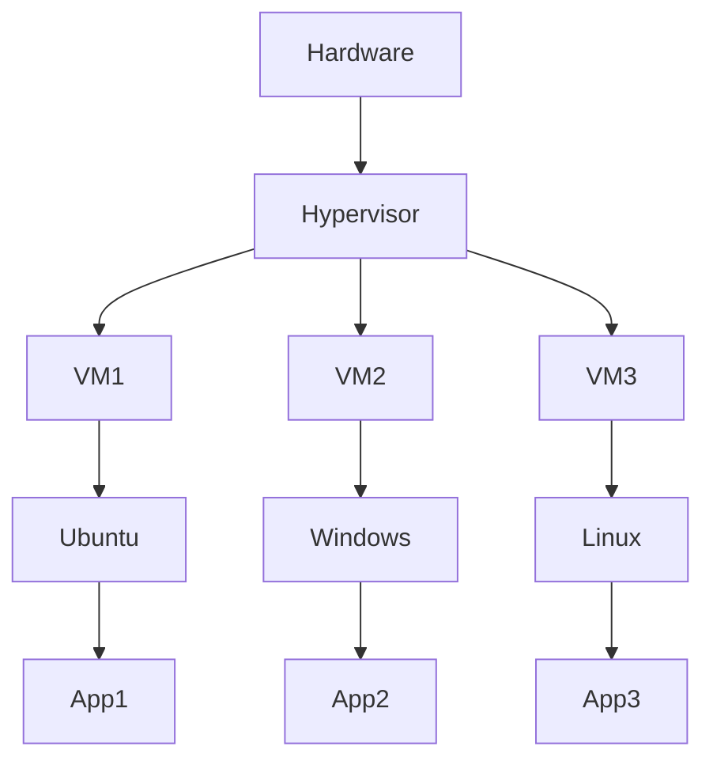
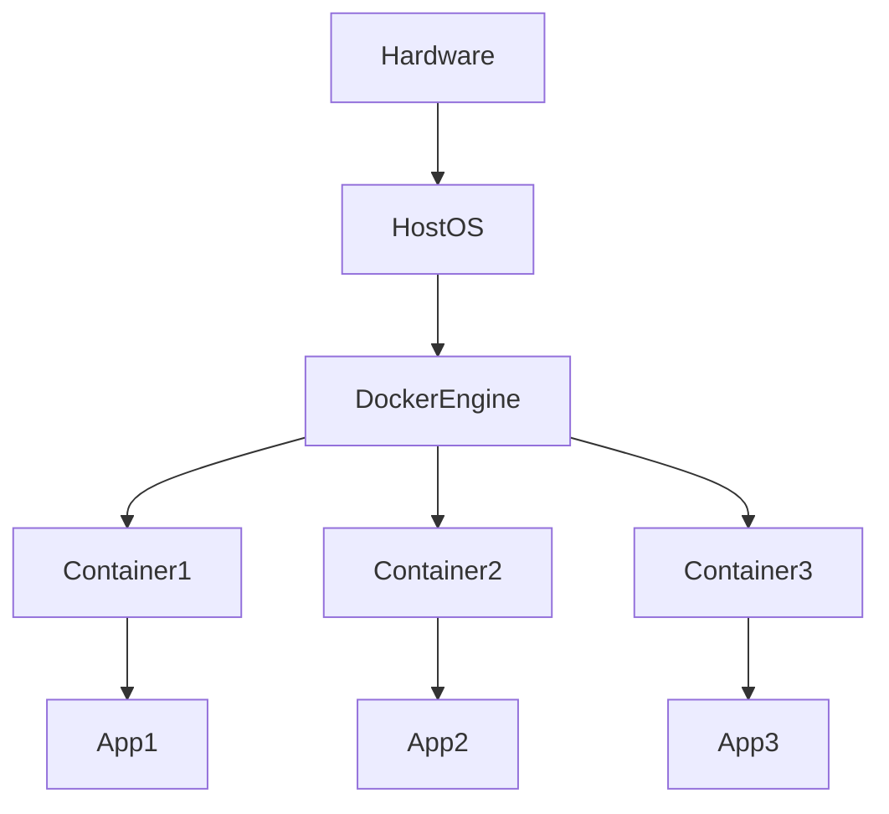
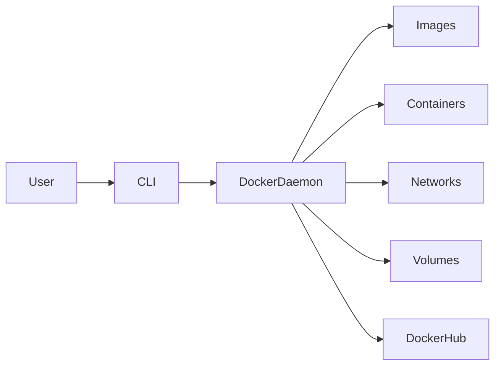
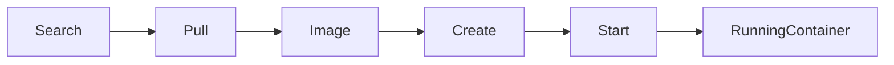
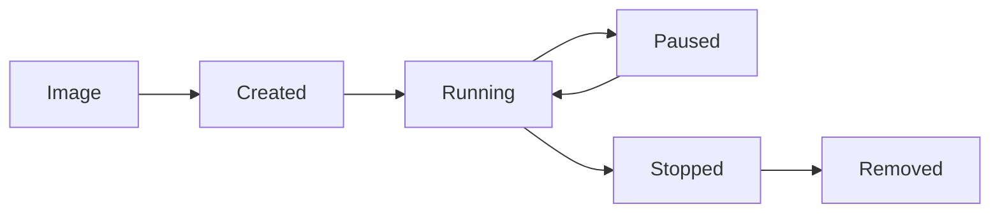

# 🐳 Docker - Complete Beginner Notes

> [!info]
> Docker is an open-source platform that enables developers to **build, package, distribute, and run applications inside containers**. It solves the classic problem:
>
> **"It works on my machine, but not on yours."**

---

# Why Docker?

Imagine you develop an application on your laptop.

When you send it to another developer or deploy it to a server, it may fail because of:

- Different Operating System
- Different Java/Python/Node version
- Missing libraries
- Missing dependencies
- Different configurations

Docker packages **everything required to run the application** into a single unit called a **Container**.

Thus,

> Build once → Run Anywhere

---

# Before Docker (Virtualization)

Before Docker, applications were deployed using **Virtual Machines (VMs).**

Each VM contains:

- Application
- Libraries
- Dependencies
- Complete Guest Operating System

## Architecture



## Problems

- Heavyweight
- High RAM usage
- Slow startup
- Each VM requires a complete Operating System
- Large storage consumption

---

# Containerization

Containerization packages

- Application
- Dependencies
- Libraries
- Runtime

inside a **Container**.

Containers share the Host Operating System.



## Advantages

- Lightweight
- Fast startup
- Less memory usage
- Portable
- Easy deployment
- Consistent environment
- Scalable
- Isolated execution

---

# Docker Architecture



---

# Docker Components

## 1. Docker Client (CLI)

User interacts with Docker using commands.

Example

```bash
docker run nginx
```

The client sends the request to Docker Daemon.

---

## 2. Docker Daemon

The Docker Daemon (`dockerd`) is the background service that manages Docker.

Responsibilities

- Pull Images
- Build Images
- Create Containers
- Start Containers
- Stop Containers
- Remove Containers
- Manage Networks
- Manage Volumes

---

## 3. Docker Engine

Docker Engine is the core runtime that creates and manages containers.

It consists of

- Docker CLI
- Docker Daemon
- REST API

---

## 4. Docker Image

An Image is a **read-only template** used to create containers.

Think of it as:

```
Image = Blueprint (Class)

Container = Running Instance (Object)
```

Example Images

- ubuntu
- nginx
- mysql
- mongo
- redis
- openjdk

---

## 5. Docker Container

A Container is a running instance of an Image.

One Image can create multiple Containers.

```
hello-world Image

↓

Container 1

↓

Container 2

↓

Container 3
```

---

## 6. Dockerfile

A Dockerfile is a text file containing instructions to build a Docker Image.

Example

```dockerfile
FROM openjdk:22-jdk

WORKDIR /app

COPY target/HelloWorld.jar app.jar

EXPOSE 8080

ENTRYPOINT ["java","-jar","app.jar"]
```

Common Dockerfile Instructions

| Instruction | Purpose |
|-------------|----------|
| FROM | Base Image |
| WORKDIR | Working Directory |
| COPY | Copy Files |
| ADD | Copy files (extra features) |
| RUN | Execute commands during build |
| ENV | Environment Variables |
| EXPOSE | Declare Ports |
| CMD | Default Command |
| ENTRYPOINT | Main Application |

---

## 7. Docker Hub

Docker Hub is an online repository containing Docker Images.

Examples

- ubuntu
- mysql
- nginx
- redis
- mongo
- openjdk

Official Images are marked with **[OK]** during search.

---

## 8. Docker Volumes

Containers are temporary.

Deleting a container deletes its internal data.

Volumes store data permanently.

```
Container Deleted

↓

Volume Remains

↓

Data Safe
```

Useful for

- MySQL
- MongoDB
- PostgreSQL

---

## 9. Docker Networks

Docker automatically creates virtual networks.

Network Types

- Bridge (Default)
- Host
- None
- Overlay

Purpose

- Container Communication
- Service Discovery
- Isolation

---

## 10. Docker Compose

Docker Compose manages multiple containers using a single YAML file.

Example Stack

```text
Frontend

↓

Backend

↓

Database
```

Instead of

```bash
docker run frontend

docker run backend

docker run mysql
```

Use

```bash
docker compose up
```

---

# Docker Workflow



---

# Common Docker Commands

## Check Docker Version

```bash
docker --version
```

---

## Search Images

```bash
docker search hello-world
```

Search Docker Hub.

---

## Download Image

```bash
docker pull hello-world
```

Downloads an Image.

---

## List Images

```bash
docker images
```

Shows downloaded Images.

---

## Create Container

```bash
docker create hello-world
```

Creates a container but does **NOT** start it.

State

```
Created
```

---

## Start Container

```bash
docker start <container_id>
```

Starts an existing container.

---

## Stop Container

```bash
docker stop <container_id>
```

Stops a running container.

---

## Restart Container

```bash
docker restart <container_id>
```

Restart container.

---

## Pause Container

```bash
docker pause <container_id>
```

Pauses processes.

Resume

```bash
docker unpause <container_id>
```

---

## Run Container

```bash
docker run hello-world
```

Internally performs

```
Pull Image
↓

Create Container
↓

Start Container
↓

Run Program
```

---

## Running Containers

```bash
docker ps
```

Shows only running containers.

---

## All Containers

```bash
docker ps -a
```

Shows

- Running
- Exited
- Created

Containers.

---

## Remove Container

```bash
docker rm <container_id>
```

Deletes container.

---

## Remove Image

```bash
docker rmi <image_id>
```

Deletes image.

Cannot remove if a container still exists.

---

## View Logs

```bash
docker logs <container_id>
```

Displays container logs.

---

## Execute Commands Inside Container

```bash
docker exec -it <container_id> bash
```

Open a terminal inside a running Linux container.

---

## Inspect Container

```bash
docker inspect <container_id>
```

Shows detailed JSON configuration.

---

## List Networks

```bash
docker network ls
```

---

## List Volumes

```bash
docker volume ls
```

---

# Container Lifecycle



---

# Docker Compose Commands

```bash
docker compose up
```

Start all services.

---

```bash
docker compose down
```

Stop all services.

---

```bash
docker compose ps
```

View running services.

---

# Java Application using Docker

## Manual Method

```bash
docker run -dit openjdk:22-jdk

docker cp target/HelloWorld.jar <container_id>:/tmp

docker commit --change='CMD ["java","-jar","/tmp/HelloWorld.jar"]' <container_id> my-java-image

docker run my-java-image
```

---

## Dockerfile Method (Recommended)

```dockerfile
FROM openjdk:22-jdk

WORKDIR /app

COPY target/HelloWorld.jar app.jar

EXPOSE 8080

ENTRYPOINT ["java","-jar","app.jar"]
```

Build Image

```bash
docker build -t helloworld:v1 .
```

Run Container

```bash
docker run -p 8080:8080 helloworld:v1
```

---

# Frequently Used Docker Commands

| Command | Description |
|----------|-------------|
| docker --version | Docker version |
| docker search | Search image |
| docker pull | Download image |
| docker images | List images |
| docker create | Create container |
| docker run | Create & Start container |
| docker start | Start container |
| docker stop | Stop container |
| docker restart | Restart container |
| docker ps | Running containers |
| docker ps -a | All containers |
| docker logs | View logs |
| docker exec | Enter container |
| docker rm | Remove container |
| docker rmi | Remove image |
| docker network ls | List networks |
| docker volume ls | List volumes |
| docker compose up | Start multiple containers |
| docker compose down | Stop multiple containers |

---

# Key Interview Questions

> [!question]
> **What is Docker?**
>
> Docker is a platform that packages applications and their dependencies into lightweight containers, enabling consistent execution across different environments.

---

> [!question]
> **Difference between Image and Container?**
>
> Image → Read-only blueprint.
>
> Container → Running instance of an Image.

---

> [!question]
> **Difference between VM and Container?**
>
> VM contains an entire Guest Operating System.
>
> Container shares the Host Operating System, making it lightweight and faster.

---

> [!question]
> **What is Docker Compose?**
>
> Docker Compose is a tool used to define and manage multiple containers using a single `compose.yaml` (or `docker-compose.yml`) file.

---

> [!tip]
> Remember the Docker flow:
>
> **Search → Pull → Build/Create → Run → Stop → Remove**

Docker compose we can run multiple container using compose

Docker file starts with the base image 
it is a docker image that your image is based upon
for java open-jdk:22-jdk
for node js - node:latest
next run directive allow  to execute linux comand

Docker basics comands 


